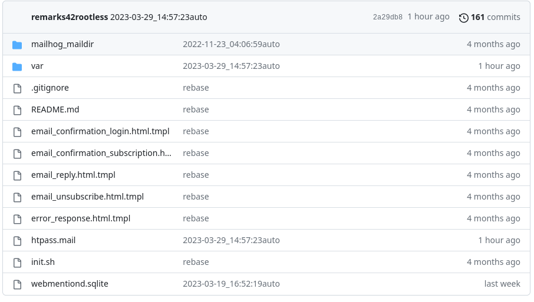

remark42 with webmentiond rootless with Pingback and MailHog

* will use a git repository under /srv to save everything
* should be setup with a healtcheck to /ping to prevent split-brain and telegram 409 problems
 

## endpoints

| Type | protected | URL |
|---|---|---|

| Webmentions (RECEIVE) | N |  /webmentions/receive |
| PingBack (RECEIVE) | N |  /webmentions/pingback |
| Ping | N |  /ping |
| Mailhog | Y |  /mail |

## parameters
| Name | Type | example |
|---|---|---|
| GIT_REPO_SYNC   | git URL | `git@gitlab.generic.lan:the-foundation/my-comments-store` | 
| GIT_REPO_KEY    | `LS0tLS` ..long base64 text.. `LS0tLS0K` |
| GIT_REPO_PUBKEY | `c3NoLXJzY` ..long base64 text.. `bi1UUDIzCg==` | 

For the  other parameters:

* refer to https://remark42.com/docs/configuration/parameters/
* check https://github.com/zerok/webmentiond/blob/main/docs/getting-started.md

## Remarks42 Prameter list:

| Command line                   | Environment                    | Default                  | Description                                               |
|--------------------------------|--------------------------------|--------------------------|-----------------------------------------------------------|
| url                            | REMARK_URL                     |                          | URL to Remark42 server, _required_                        |
| secret                         | SECRET                         |                          | the shared secret key used to sign JWT, should be a random, long, hard-to-guess string, _required_ |
| site                           | SITE                           | `remark`                 | site name(s), _multi_                                     |
| store.type                     | STORE_TYPE                     | `bolt`                   | type of storage, `bolt` or `rpc`                          |
| store.bolt.path                | STORE_BOLT_PATH                | `./var`                  | parent directory for the bolt files                       |
| store.bolt.timeout             | STORE_BOLT_TIMEOUT             | `30s`                    | boltdb access timeout                                     |
| store.rpc.api                  | STORE_RPC_API                  |                          | rpc extension api url                                     |
| store.rpc.timeout              | STORE_RPC_TIMEOUT              |                          | http timeout (default: 5s)                                |
| store.rpc.auth_user            | STORE_RPC_AUTH_USER            |                          | basic auth user name                                      |
| store.rpc.auth_passwd          | STORE_RPC_AUTH_PASSWD          |                          | basic auth user password                                  |
| admin.type                     | ADMIN_TYPE                     | `shared`                 | type of admin store, `shared` or `rpc`                    |
| admin.rpc.api                  | ADMIN_RPC_API                  |                          | rpc extension api url                                     |
| admin.rpc.timeout              | ADMIN_RPC_TIMEOUT              |                          | http timeout (default: 5s)                                |
| admin.rpc.auth_user            | ADMIN_RPC_AUTH_USER            |                          | basic auth user name                                      |
| admin.rpc.auth_passwd          | ADMIN_RPC_AUTH_PASSWD          |                          | basic auth user password                                  |
| admin.rpc.secret_per_site      | ADMIN_RPC_SECRET_PER_SITE      |                          | enable JWT secret retrieval per aud, which is site_id in this case |
| admin.shared.id                | ADMIN_SHARED_ID                |                          | admin IDs (list of user IDs), _multi_                     |
| admin.shared.email             | ADMIN_SHARED_EMAIL             | `admin@${REMARK_URL}`    | admin emails, _multi_                                     |
| backup                         | BACKUP_PATH                    | `./var/backup`           | backups location                                          |
| max-back                       | MAX_BACKUP_FILES               | `10`                     | max backup files to keep                                  |
| cache.type                     | CACHE_TYPE                     | `mem`                    | type of cache, `redis_pub_sub` or `mem` or `none`         |
| cache.redis_addr               | CACHE_REDIS_ADDR               | `127.0.0.1:6379`         | address of Redis PubSub instance, turn `redis_pub_sub` cache on for distributed cache |
| cache.max.items                | CACHE_MAX_ITEMS                | `1000`                   | max number of cached items, `0` - unlimited               |
| cache.max.value                | CACHE_MAX_VALUE                | `65536`                  | max size of the cached value, `0` - unlimited             |
| cache.max.size                 | CACHE_MAX_SIZE                 | `50000000`               | max size of all cached values, `0` - unlimited            |
| avatar.type                    | AVATAR_TYPE                    | `fs`                     | type of avatar storage, `fs`, `bolt`, or `uri`            |
| avatar.fs.path                 | AVATAR_FS_PATH                 | `./var/avatars`          | avatars location for `fs` store                           |
| avatar.bolt.file               | AVATAR_BOLT_FILE               | `./var/avatars.db`       | avatars `bolt` file location                              |
| avatar.uri                     | AVATAR_URI                     | `./var/avatars`          | avatars store URI                                         |
| avatar.rsz-lmt                 | AVATAR_RESIZE                  | `0` (disabled)           | max image size for resizing avatars on save               |
| image.type                     | IMAGE_TYPE                     | `fs`                     | type of image storage, `fs`, `bolt` or `rpc`              |
| image.fs.path                  | IMAGE_FS_PATH                  | `./var/pictures`         | permanent location of images                              |
| image.fs.staging               | IMAGE_FS_STAGING               | `./var/pictures.staging` | staging location of images                                |
| image.fs.partitions            | IMAGE_FS_PARTITIONS            | `100`                    | number of image partitions                                |
| image.bolt.file                | IMAGE_BOLT_FILE                | `/var/pictures.db`       | images bolt file location                                 |
| image.rpc.api                  | IMAGE_RPC_API                  |                          | rpc extension api url                                     |
| image.rpc.timeout              | IMAGE_RPC_TIMEOUT              |                          | http timeout (default: 5s)                                |
| image.rpc.auth_user            | IMAGE_RPC_AUTH_USER            |                          | basic auth user name                                      |
| image.rpc.auth_passwd          | IMAGE_RPC_AUTH_PASSWD          |                          | basic auth user password                                  |
| image.max-size                 | IMAGE_MAX_SIZE                 | `5000000`                | max size of image file                                    |
| image.resize-width             | IMAGE_RESIZE_WIDTH             | `2400`                   | width of a resized image                                  |
| image.resize-height            | IMAGE_RESIZE_HEIGHT            | `900`                    | height of a resized image                                 |
| auth.ttl.jwt                   | AUTH_TTL_JWT                   | `5m`                     | JWT TTL                                                   |
| auth.ttl.cookie                | AUTH_TTL_COOKIE                | `200h`                   | cookie TTL                                                |
| auth.send-jwt-header           | AUTH_SEND_JWT_HEADER           | `false`                  | send JWT as a header instead of a cookie                  |
| auth.same-site                 | AUTH_SAME_SITE                 | `default`                | set same site policy for cookies (`default`, `none`, `lax` or `strict`) |
| auth.apple.cid                 | AUTH_APPLE_CID                 |                          | Apple client ID                                           |
| auth.apple.tid                 | AUTH_APPLE_TID                 |                          | Apple service ID                                          |
| auth.apple.kid                 | AUTH_APPLE_KID                 |                          | Private key ID                                            |
| auth.apple.private-key-filepath | AUTH_APPLE_PRIVATE_KEY_FILEPATH | `/srv/var/apple.p8`        | Private key file location                                 |
| auth.google.cid                | AUTH_GOOGLE_CID                |                          | Google OAuth client ID                                    |
| auth.google.csec               | AUTH_GOOGLE_CSEC               |                          | Google OAuth client secret                                |
| auth.facebook.cid              | AUTH_FACEBOOK_CID              |                          | Facebook OAuth client ID                                  |
| auth.facebook.csec             | AUTH_FACEBOOK_CSEC             |                          | Facebook OAuth client secret                              |
| auth.microsoft.cid             | AUTH_MICROSOFT_CID             |                          | Microsoft OAuth client ID                                 |
| auth.microsoft.csec            | AUTH_MICROSOFT_CSEC            |                          | Microsoft OAuth client secret                             |
| auth.github.cid                | AUTH_GITHUB_CID                |                          | GitHub OAuth client ID                                    |
| auth.github.csec               | AUTH_GITHUB_CSEC               |                          | GitHub OAuth client secret                                |
| auth.twitter.cid               | AUTH_TWITTER_CID               |                          | Twitter Consumer API Key                                  |
| auth.twitter.csec              | AUTH_TWITTER_CSEC              |                          | Twitter Consumer API Secret key                           |
| auth.patreon.cid               | AUTH_PATREON_CID               |                          | Patreon OAuth Client ID                                   |
| auth.patreon.csec              | AUTH_PATREON_CSEC              |                          | Patreon OAuth Client Secret                               |
| auth.telegram                  | AUTH_TELEGRAM                  | `false`                  | Enable Telegram auth (telegram.token must be present)     |
| auth.yandex.cid                | AUTH_YANDEX_CID                |                          | Yandex OAuth client ID                                    |
| auth.yandex.csec               | AUTH_YANDEX_CSEC               |                          | Yandex OAuth client secret                                |
| auth.dev                       | AUTH_DEV                       | `false`                  | local OAuth2 server, development mode only                |
| auth.anon                      | AUTH_ANON                      | `false`                  | enable anonymous login                                    |
| auth.email.enable              | AUTH_EMAIL_ENABLE              | `false`                  | enable auth via email                                     |
| auth.email.from                | AUTH_EMAIL_FROM                |                          | email from                                                |
| auth.email.subj                | AUTH_EMAIL_SUBJ                | `remark42 confirmation`  | email subject                                             |
| auth.email.content-type        | AUTH_EMAIL_CONTENT_TYPE        | `text/html`              | email content type                                        |
| notify.users                   | NOTIFY_USERS                   | none                     | type of user notifications (`telegram`, `email`), _multi_ |
| notify.admins                  | NOTIFY_ADMINS                  | none                     | type of admin notifications (`telegram`, `slack`, `webhook` and/or `email`), _multi_ |
| notify.queue                   | NOTIFY_QUEUE                   | `100`                    | size of notification queue                                |
| notify.telegram.chan           | NOTIFY_TELEGRAM_CHAN           |                          | the ID of telegram channel for admin notifications        |
| notify.slack.token             | NOTIFY_SLACK_TOKEN             |                          | Slack token                                               |
| notify.slack.chan              | NOTIFY_SLACK_CHAN              | `general`                | Slack channel for admin notifications                     |
| notify.webhook.url             | NOTIFY_WEBHOOK_URL             |                          | Webhook notification URL for admin notifications          |
| notify.webhook.template        | NOTIFY_WEBHOOK_TEMPLATE        | `{"text": "{{.Text}}"}`  | Webhook payload template                                  |
| notify.webhook.headers         | NOTIFY_WEBHOOK_HEADERS         |                          | HTTP header in format Header1:Value1,Header2:Value2,...   |
| notify.webhook.timeout         | NOTIFY_WEBHOOK_TIMEOUT         | `5s`                     | Webhook connection timeout                                |
| notify.email.from_address      | NOTIFY_EMAIL_FROM              |                          | from email address                                        |
| notify.email.verification_subj | NOTIFY_EMAIL_VERIFICATION_SUBJ | `Email verification`     | verification message subject                              |
| telegram.token                 | TELEGRAM_TOKEN                 |                          | Telegram token (used for auth and Telegram notifications) |
| telegram.timeout               | TELEGRAM_TIMEOUT               | `5s`                     | Telegram connection timeout                               |
| smtp.host                      | SMTP_HOST                      |                          | SMTP host                                                 |
| smtp.port                      | SMTP_PORT                      |                          | SMTP port                                                 |
| smtp.username                  | SMTP_USERNAME                  |                          | SMTP user name                                            |
| smtp.password                  | SMTP_PASSWORD                  |                          | SMTP password                                             |
| smtp.login_auth                | SMTP_LOGIN_AUTH                | `false                   | enable LOGIN auth instead of PLAIN                        |
| smtp.tls                       | SMTP_TLS                       | `false`                  | enable TLS for SMTP                                       |
| smtp.starttls                  | SMTP_STARTTLS                  | `false`                  | enable StartTLS for SMTP                                  |
| smtp.timeout                   | SMTP_TIMEOUT                   | `10s`                    | SMTP TCP connection timeout                               |
| ssl.type                       | SSL_TYPE                       | none                     | `none`-HTTP, `static`-HTTPS, `auto`-HTTPS + le            |
| ssl.port                       | SSL_PORT                       | `8443`                   | port for HTTPS server                                     |
| ssl.cert                       | SSL_CERT                       |                          | path to the cert.pem file                                 |
| ssl.key                        | SSL_KEY                        |                          | path to the key.pem file                                  |
| ssl.acme-location              | SSL_ACME_LOCATION              | `./var/acme`             | dir where obtained le-certs will be stored                |
| ssl.acme-email                 | SSL_ACME_EMAIL                 |                          | admin email for receiving notifications from LE           |
| max-comment                    | MAX_COMMENT_SIZE               | `2048`                   | comment's size limit                                      |
| max-votes                      | MAX_VOTES                      | `-1`                     | votes limit per comment, `-1` - unlimited                 |
| votes-ip                       | VOTES_IP                       | `false`                  | restrict votes from the same IP                           |
| anon-vote                      | ANON_VOTE                      | `false`                  | allow voting for anonymous users, require VOTES_IP to be enabled as well |
| votes-ip-time                  | VOTES_IP_TIME                  | `5m`                     | same IP vote restriction time, `0s` - unlimited           |
| low-score                      | LOW_SCORE                      | `-5`                     | low score threshold                                       |
| critical-score                 | CRITICAL_SCORE                 | `-10`                    | critical score threshold                                  |
| positive-score                 | POSITIVE_SCORE                 | `false`                  | restricts comment's score to be only positive             |
| restricted-words               | RESTRICTED_WORDS               |                          | words banned in comments (can use `*`), _multi_           |
| restricted-names               | RESTRICTED_NAMES               |                          | names prohibited to use by the user, _multi_              |
| edit-time                      | EDIT_TIME                      | `5m`                     | edit window                                               |
| admin-edit                     | ADMIN_EDIT                     | `false`                  | unlimited edit for admins                                 |
| read-age                       | READONLY_AGE                   |                          | read-only age of comments, days                           |
| image-proxy.http2https         | IMAGE_PROXY_HTTP2HTTPS         | `false`                  | enable HTTP->HTTPS proxy for images                       |
| image-proxy.cache-external     | IMAGE_PROXY_CACHE_EXTERNAL     | `false`                  | enable caching external images to current image storage   |
| emoji                          | EMOJI                          | `false`                  | enable emoji support                                      |
| simple-view                    | SIMPLE_VIEW                    | `false`                  | minimized UI with basic info only                         |
| proxy-cors                     | PROXY_CORS                     | `false`                  | disable internal CORS and delegate it to proxy            |
| allowed-hosts                  | ALLOWED_HOSTS                  | enable all               | limit hosts/sources allowed to embed comments             |
| address                        | REMARK_ADDRESS                 | all interfaces           | web server listening address                              |
| port                           | REMARK_PORT                    | `8080`                   | web server port                                           |
| web-root                       | REMARK_WEB_ROOT                | `./web`                  | web server root directory                                 |
| update-limit                   | UPDATE_LIMIT                   | `0.5`                    | updates/sec limit                                         |
| subscribers-only               | SUBSCRIBERS_ONLY               | `false`                  | enable commenting only for Patreon subscribers            |
| disable-signature              | DISABLE_SIGNATURE              | `false`                  | disable server signature in headers                       |
| admin-passwd                   | ADMIN_PASSWD                   | none (disabled)          | password for `admin` basic auth                           |
| dbg                            | DEBUG                          | `false`                  | debug mode                                                |

---

<h3>A project of the foundation</h3>
<a href="https://the-foundation.gitlab.io/">

</a>

## Todo
- [ ] MORE DOCUMENTATION
- [ ] [Invite team members and collaborators](https://docs.gitlab.com/ee/user/project/members/)
- [ ] [Create a new merge request](https://docs.gitlab.com/ee/user/project/merge_requests/creating_merge_requests.html)
- [ ] [Automatically close issues from merge requests](https://docs.gitlab.com/ee/user/project/issues/managing_issues.html#closing-issues-automatically)
- [ ] [Enable merge request approvals](https://docs.gitlab.com/ee/user/project/merge_requests/approvals/)
- [ ] [Automatically merge when pipeline succeeds](https://docs.gitlab.com/ee/user/project/merge_requests/merge_when_pipeline_succeeds.html)

